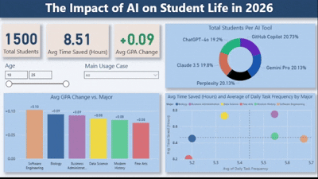

# The Impact of AI on Student Life (2026) — Executive Power BI Dashboard

An end-to-end business intelligence and data visualization project analyzing how university students integrate generative artificial intelligence into their academic workflows. This dashboard moves beyond descriptive statistics to provide an interactive **Consulting Matrix**, proving the direct correlation between AI adoption frequency, workflow efficiency, and tangible academic performance.

* **Dataset:** [How AI is Changing Life | AI and Student Life 2026 - Kaggle](https://www.kaggle.com/datasets/sohaibdevv/ai-and-student-life-2026-the-new-normal)


---

## Dashboard Walkthrough & Interactive Demo
*(The animated preview below demonstrates the dynamic Z-pattern layout, conditional formatting, and responsive analytics lines).*



---

## Executive Summary & Business Case

As generative AI tools proliferate across academic and professional sectors, institutions require empirical evidence of their utility. This project analyzes the data of **1,500 university students** to establish whether AI usage translates to measurable productivity gains and superior outcomes. 

### **High-Level Insights:**
- **Massive Time Efficiencies:** Active users reclaim an average of **8.51 hours per week** by automating routine research, debugging, and drafting tasks.
- **Measurable Academic Lift:** AI assistance correlates with an average cumulative GPA positive shift of **+0.09 points**.
- **Balanced Market Distribution:** Technical tools like **GitHub Copilot** hold a slight lead among specific cohorts, but overall adoption is highly balanced across top multimodal platforms (**Gemini Pro**, **Perplexity**, **Claude 3.5**, and **ChatGPT-4o**).

---

## Core Analytical Questions Answered

Every visual on this dashboard is engineered to answer a specific, high-level stakeholder question regarding user behavior and ROI:

### **1. Top Header Ribbon (The Contextual Overview)**
* **Questions Answered:** *What is the total sample size? What is the baseline efficiency gain? Is the overall academic impact positive or negative?*
* **Visual Implementation:** Three high-contrast KPI cards featuring custom text injection (`+0.09`) and dynamic conditional coloring (Green/Red) to ensure immediate cognitive processing without requiring the user to interpret charts.

### **2. Total Students Per AI Tool (Donut Chart)**
* **Question Answered:** *Which generative AI platforms command the highest market share and user trust among university students?*
* **Analytical Value:** Establishes platform dominance. It reveals that while GitHub Copilot leads slightly due to highly active technical majors, the landscape is incredibly competitive, with users distributing their workflows almost evenly across five major tools.

### **3. Avg GPA Change vs. Major (Clustered Column Chart)**
* **Question Answered:** *Does AI assistance benefit all academic disciplines equally, or do technical majors extract higher academic value?*
* **Analytical Value:** Proves that **Software Engineering (+0.10)** and **Biology (+0.09)** extract the highest tangible grade improvements, while disciplines like **Fine Arts (+0.08)** still see a positive, albeit slightly lower, academic lift.

### **4. Detailed Behavioral Analysis (Dynamic Quadrant Scatter Plot)**
* **Question Answered:** *How does the frequency of daily AI usage dictate overall time-saving efficiency across different fields of study?*
* **Analytical Value:** Acts as a strategic Consulting Matrix by plotting academic majors across two dynamic axes (Daily Frequency vs. Hours Saved). Using **DAX-driven Dynamic Median Lines**, it automatically classifies majors into four distinct behavioral quadrants:
  - **Power Users (Top-Right):** High daily frequency, high hours saved (e.g., Software Engineering, Business Administration).
  - **Efficient Adopters (Top-Left):** Lower daily interaction but highly efficient, high-impact workflows.
  - **Light Users (Bottom-Left):** Infrequent usage resulting in lower overall time reclaimed.
  - **Inefficient Users (Bottom-Right):** High frequency of use but low time saved, indicating a need for better prompt engineering or tool training.

---

## Advanced Technical Architecture & UI/UX

This dashboard strictly bypasses default settings to showcase advanced technical proficiency in **Microsoft Power BI**:

* **Z-Pattern Information Hierarchy:** Engineered specifically for executive scanning patterns on a standard **Landscape 16:9** canvas. High-level totals sit at the top left, foundational distribution charts sit in the middle, and deep-dive exploratory analytics are anchored at the bottom right.
* **Custom Format Strings:** Numeric string formatting is injected directly into the DAX measures to output distinct directional Unicode arrows without altering the underlying raw float values:
  ```text
  +0.00;-0.00;0.00
  ```
* **Context-Aware DAX Crosshairs:** The quadrant division lines do not use hard-coded static values. Instead, custom DAX measures calculate the exact Median of the visible data. When an end-user adjusts the global Age slider or Main Usage Case dropdown, the quadrant crosshairs instantly recalculate and snap to the true center of the new subset.

---

## Execution & Local Deployment
* Clone this repository to your local machine.
* Download the complete AI_Impact_Student_Life.pbix file.
* Open using Microsoft Power BI Desktop.
* Interact with the left-hand filter ribbon to test cross-filtering responsiveness across different demographic segments.
---
